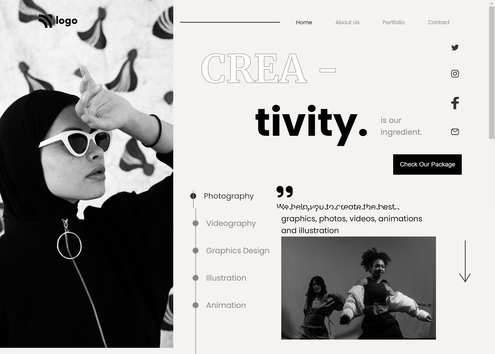

# _Project_ | _Creativity Home Page_  

_by Tasmiya 💗_

### _Live Link_ -: [Creativity Home Page](https://tasmiya-proj-14.netlify.app
)

## Technologies used

- HTML
- CSS

## 💡 What I have learn ?

- learned about CSS display.
- got good understanding of HTML & CSS
- learned about CSS flexbox and CSS positions.
- leaned indepth about -webkit-text-stroke and -webkit-text-fill-color .

## Time taken to Finish this project

- This project took around 6 hours to complete 😊.
